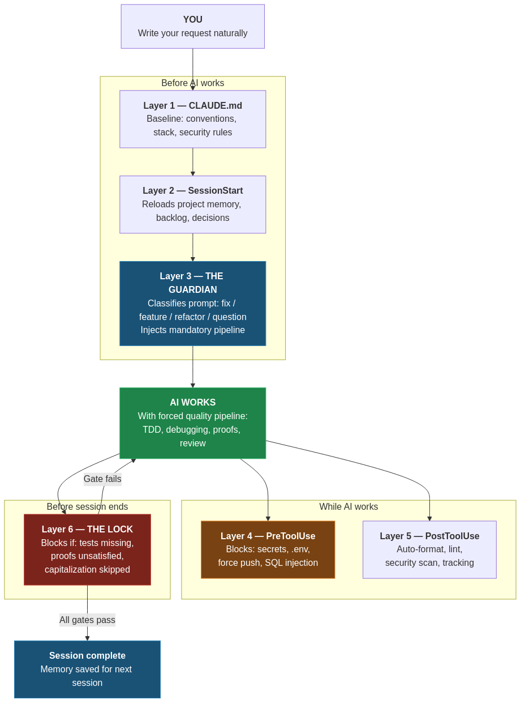
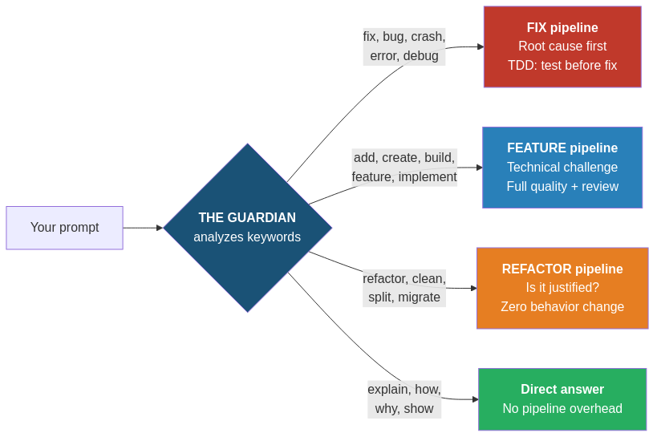
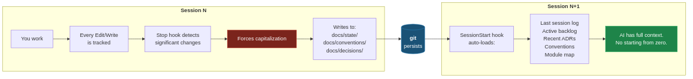
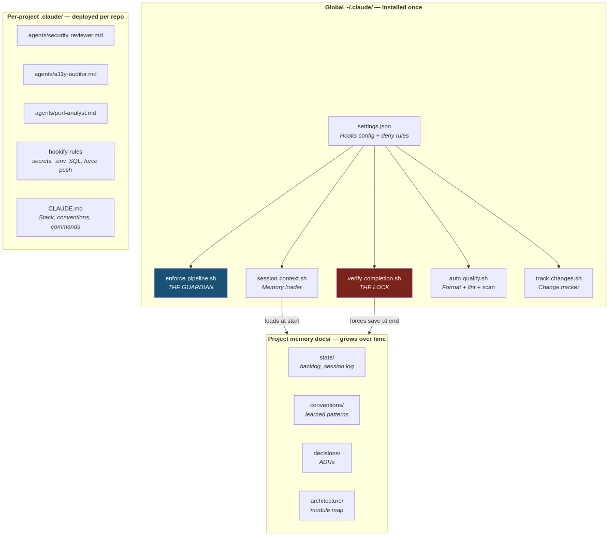

# Autonomic Nervous System

**Deterministic quality enforcement for Claude Code.**

Your AI codes. This system makes sure it codes *right*.

---

Every time you ask Claude Code to fix a bug, build a feature, or refactor code, the same question applies: **did it actually follow the process?** Did it run tests? Did it check for security issues? Did it think before coding?

The Autonomic Nervous System answers that question with hooks, not hope. It wraps Claude Code in a deterministic enforcement layer that **forces** quality on every single request. No discipline required. No prompts to remember. The system does it for you.

## The Problem

Claude Code is powerful. But power without guardrails produces inconsistent results:

- Tests skipped "because the change is simple"
- Security vulnerabilities introduced silently
- Fixes applied without understanding the root cause
- Sessions end with no memory of what was learned
- Refactoring that quietly changes behavior
- Secrets accidentally hardcoded

You can write better prompts. You can add instructions to CLAUDE.md. But instructions are *suggestions* — the model can and will ignore them under context pressure.

## The Solution

Hooks are not suggestions. **Hooks are deterministic.** They run every time, on every request, with zero exceptions.

The Autonomic Nervous System deploys 6 layers of enforcement around Claude Code:

<p align="center">
  
</p>

### What each layer does

| Layer | Hook | Role | Can block? |
|-------|------|------|:---:|
| 1 | `CLAUDE.md` | Project conventions, stack, security rules | No |
| 2 | `SessionStart` | Reloads project memory (state, backlog, decisions, conventions) | No |
| 3 | **`UserPromptSubmit`** | **THE GUARDIAN** — classifies every prompt (fix/feature/refactor/question) and injects the mandatory quality pipeline | No |
| 4 | `PreToolUse` | Blocks dangerous patterns: hardcoded secrets, `.env` edits, force push, SQL injection | **Yes** |
| 5 | `PostToolUse` | Auto-format, auto-lint, security scan, change tracking | No |
| 6 | **`Stop`** | **THE LOCK** — blocks session end if tests missing, proofs unsatisfied, or capitalization skipped | **Yes** |

### Pipeline classification

The Guardian analyzes every prompt and injects the right pipeline:

| You write | Detected as | Injected pipeline |
|-----------|------------|-------------------|
| "fix the login bug" | **FIX** | Root cause analysis (systematic-debugging) + TDD (test before fix) + proof verification |
| "add Stripe payments" | **FEATURE** | Technical challenge (is this needed? simpler approach? risks?) + full quality pipeline + code review |
| "refactor the auth module" | **REFACTOR** | Challenge (is this justified now?) + zero behavior change rule + before/after test parity |
| "how does the router work?" | **QUESTION** | Direct answer, no pipeline overhead |

<p align="center">
  
</p>

### Technical challenge (built-in)

Before any feature or refactoring, the system forces three questions:

1. **Is this actually necessary**, or does an existing mechanism already solve it?
2. **What is the simplest approach** that addresses the need?
3. **What is the main risk** (security, tech debt, complexity)?

If any answer reveals a problem, the AI flags it before writing a single line of code.

### Automatic memory

The system maintains project memory across sessions:

<p align="center">
  
</p>

No more "starting from zero" on every session.

## Installation

### Prerequisites

- [Claude Code](https://claude.ai/code) installed
- `jq` installed (`apt install jq` / `brew install jq`)
- [Superpowers plugin](https://github.com/anthropics/claude-plugins-official) installed

### One command

```bash
git clone https://github.com/yywar/autonomic-nervous-system.git
cd autonomic-nervous-system
bash install.sh
```

The installer:
- Backs up your existing `settings.json` before any modification
- Merges hooks without overwriting plugin hooks
- Adds security deny rules
- Disables legacy conflicting skills
- Installs the project deployment template

### Then install the recommended plugins

Inside Claude Code:

```
/plugin install security-guidance@claude-plugins-official
/plugin install hookify@claude-plugins-official
/plugin install typescript-lsp@claude-plugins-official
/plugin install commit-commands@claude-plugins-official
/plugin install pr-review-toolkit@claude-plugins-official
/plugin install playwright@claude-plugins-official
/plugin install github@claude-plugins-official
```

### Deploy on any project

```bash
bash ~/.claude/project-template/deploy-to-project.sh /path/to/your/project
```

This creates:
- `.claude/agents/` — 3 specialized review agents
- `.claude/hookify.*.local.md` — 4 security rules
- `CLAUDE.md` — template to customize with your stack
- `docs/` — directory structure for project memory

## What's included

### Hooks (global, active on all projects)

| File | Event | Role |
|------|-------|------|
| `enforce-pipeline.sh` | UserPromptSubmit | Classifies requests, injects mandatory pipeline |
| `session-context.sh` | SessionStart | Reloads project memory + system rules |
| `verify-completion.sh` | Stop | Blocks if tests/proofs missing, forces capitalization |
| `auto-quality.sh` | PostToolUse | Auto-format, lint, security scan after every edit |
| `track-changes.sh` | PostToolUse | Tracks modified files for capitalization decisions |

### Agents (per-project)

| Agent | Focus |
|-------|-------|
| `security-reviewer.md` | OWASP Top 10, injection, XSS, auth flaws, secrets detection |
| `a11y-auditor.md` | WCAG 2.2 Level AA compliance |
| `perf-analyst.md` | Bundle size, rendering, network, Core Web Vitals |

### Security rules (per-project, hookify format)

| Rule | Action |
|------|--------|
| `block-secrets` | **Blocks** hardcoded API keys, tokens, passwords |
| `block-env-commit` | **Blocks** any modification to `.env` files |
| `warn-sql-injection` | **Warns** on string concatenation in SQL queries |
| `block-force-push` | **Blocks** `git push --force` |

### Global deny rules (settings.json)

- `rm -rf /` and `rm -rf ~` blocked
- Force push to main/master blocked
- Read access to `~/.ssh/`, `~/.aws/`, `~/.gnupg/` blocked

## Compatibility

Designed to work with:
- **[Superpowers](https://github.com/obra/superpowers)** — TDD, systematic debugging, code review, plan execution
- **[Jeyant](https://github.com/yywar)** — Quality pipeline with tiered routing, proof contracts, adversarial review, capitalization
- **[Feature Dev](https://github.com/anthropics/claude-plugins-official)** — Codebase exploration, architecture design, code review agents

The system complements these tools by adding the enforcement layer they lack. Skills define *what* quality means. The Autonomic Nervous System *guarantees* it happens.

## Uninstall

```bash
# Restore settings.json
cp ~/.claude/settings.json.bak ~/.claude/settings.json

# Remove hooks
rm ~/.claude/hooks/enforce-pipeline.sh
rm ~/.claude/hooks/session-context.sh
rm ~/.claude/hooks/verify-completion.sh
rm ~/.claude/hooks/auto-quality.sh
rm ~/.claude/hooks/track-changes.sh

# Re-enable legacy skills (if desired)
mv ~/.claude/skills/brainstorming/SKILL.md.disabled ~/.claude/skills/brainstorming/SKILL.md
mv ~/.claude/skills/planification/SKILL.md.disabled ~/.claude/skills/planification/SKILL.md
```

## Architecture overview

<p align="center">
  
</p>

## Philosophy

> Instructions are wishes. Hooks are guarantees.

The best process is the one you can't skip. This system was born from a simple observation: AI coding assistants produce their best work when they follow a structured process — and their worst work when they don't. Instead of relying on the model's judgment to follow the process, we made the process inescapable.

## Author

**Yann LOMBRET** — [@yywar](https://github.com/yywar)

## License

MIT
